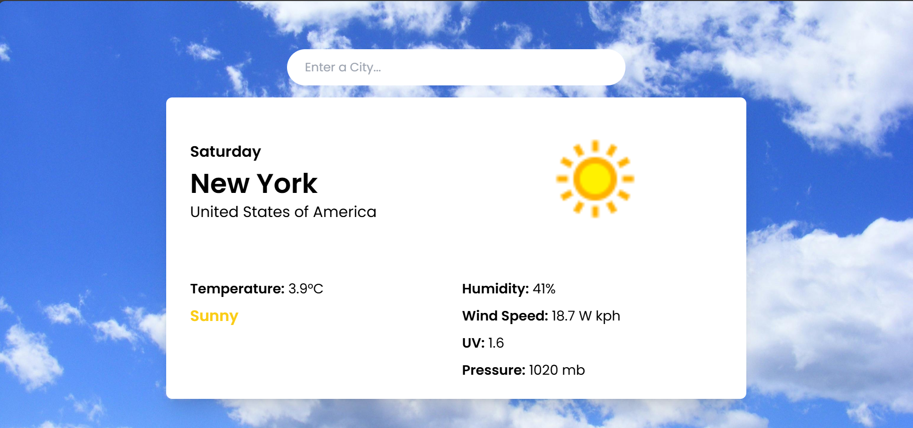

# Weather App 🌦️

The Weather App is a simple, responsive web application that provides real-time weather updates for any location worldwide. With a clean and intuitive user interface, the app allows users to quickly search for weather details, including temperature, humidity, and other weather conditions, ensuring a seamless experience across all devices.

---

## Features ✨

- Real-time weather updates.
- Responsive design for all screen sizes.
- Search functionality to find weather details by location.
- User-friendly and intuitive UI.

---

## Screenshots 🌟

### Main Screen
  
*This is the main screen of the weather app showing the current weather for a selected location.*

### Search a City
  
*view of the app when user entered a city to search*

### Loading Screen
  
*This is the screen of app when loading for a searched city or a network delay*

### Responsiveness
  
*This is the mobile view of weather app*

## Technologies Used 🛠️

- **Frontend:** React.js
- **API:** Free Weather Api
- **Other Features:** Fully Responsive Design

---

## How to Run the Project 🚀

1. Clone the repository:
   ```bash
   git clone https://github.com/Amjadjamali32/OpenWeather.git
